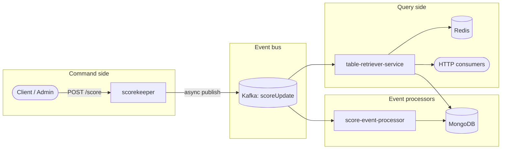

# League Table Management System

A **CQRS** reference implementation for football league tables: clients send **commands** to record results without waiting on downstream processing; events flow through Kafka; **projectors** materialise standings into MongoDB; the **query** service serves reads—including point-in-time and matchday snapshots.

This repository demonstrates **system design** (command/query/event boundaries, non-blocking writes, deployable modules) and **implementation craft** (domain rules, replay, caching, tests). Module-level READMEs cover internals; start here for the big picture.

---

## CQRS in this system

| Role | Module | Responsibility |
|------|--------|----------------|
| **Command** | [`scorekeeper`](scorekeeper/) | Accept `POST /score`, validate, map to `UpdatePointsEvent`, **publish to Kafka** and return—clients are not blocked on table projection |
| **Integration contract** | [`league-table-events`](league-table-events/) | `UpdatePointsEvent` / `Record` — wire format on `scoreUpdate` |
| **Domain** | [`league-table-domain`](league-table-domain/) | Standings model, ranking sort, event → table projection |
| **Event processor** | [`score-event-processor`](score-event-processor/) | Consume `scoreUpdate` → apply rules → persist **current** table to MongoDB (write-side projector) |
| **Query** | [`table-retriever-service`](table-retriever-service/) | HTTP API for latest table; **Kafka replay** for historical views; Redis cache |

Kafka is the **durable log** of match results. MongoDB holds **materialised projections** (“table as of now”). The query service can rebuild past views by replaying the log—without pushing that work onto the command API.



**Typical flow:** match result posted to scorekeeper → events on `scoreUpdate` → score-event-processor (and query listener) update MongoDB → clients read via `GET /table/{id}` or replay endpoints.

### Why scorekeeper is the command side

In strict CQRS, the **command** accepts intent to change state and returns without owning the read model. Scorekeeper does exactly that in CQRS mode (`feature.cqrsmode=true`): it transforms HTTP payloads into events and uses `KafkaTemplate.send`—**non-blocking** from the caller’s perspective—while processors catch up asynchronously.

[`score-event-processor`](score-event-processor/) is **not** the command service; it is an **event consumer / projector** that applies the same events to MongoDB. Naming it “command” was misleading and has been corrected across this repo.

---

## Modules

| Module | Docs | Port (local) |
|--------|------|--------------|
| Command API | [scorekeeper/README.md](scorekeeper/README.md) | 8081 |
| Event contract | [league-table-events/README.md](league-table-events/README.md) | — (library) |
| Domain | [league-table-domain/README.md](league-table-domain/README.md) | — (library) |
| Event processor | [score-event-processor/README.md](score-event-processor/README.md) | 8080 |
| Query service | [table-retriever-service/README.md](table-retriever-service/README.md) | 8083 |

---

## Technology choices

- **Java 17**, **Spring Boot 3.4**, **Gradle** multi-project build
- **Apache Kafka** — event log (`scoreUpdate`)
- **MongoDB** — `PointsTable` / `Standing` projections
- **Redis** — cache for replay-heavy query endpoints
- **Docker Compose** — full stack with health checks

---

## Quick start

**Prerequisites:** JDK 17+, Docker with Compose v2.

```bash
make up
```

Verify:

```bash
curl http://localhost:8081/ping              # command (scorekeeper)
curl http://localhost:8080/actuator/health   # event processor
curl http://localhost:8083/ping              # query
```

**Build & test:**

```bash
./gradlew test
```

**End-to-end smoke test** (requires running stack):

```bash
make up
make smoke-test
```

Posts a result to scorekeeper, then polls the query API until the projected table shows the expected points.

**Run on the host** (infra in Docker, apps via Gradle):

```bash
make infra
./gradlew :scorekeeper:bootRun
./gradlew :score-event-processor:bootRun
./gradlew :table-retriever-service:bootRun
```

**Stop:**

```bash
make down          # keep data volumes
make down-clean    # remove volumes
```

---

## Design highlights

1. **Commands decoupled from projection** — Scorekeeper publishes and returns; processors and query paths consume at their own pace.

2. **Event-sourced reads, materialised writes** — Historical queries replay Kafka on the query side; processors maintain “latest” snapshots in MongoDB.

3. **Shared event contract** — `league-table-events` keeps publishers and consumers aligned.

4. **DRY domain rules** — `league-table-domain` owns ranking sort and table reconstruction used by all services.

5. **Independent deployables** — Each service is a bootable JAR and Docker image.

---

## Repository layout

```
.
├── build.gradle / settings.gradle
├── docker-compose.yml
├── Makefile
├── league-table-events/         # Kafka contract (UpdatePointsEvent, Record)
├── league-table-domain/         # standings, ranking, projection
├── scorekeeper/                 # command (CQRS write API)
├── score-event-processor/       # Kafka → MongoDB projector
└── table-retriever-service/     # query (HTTP + replay)
```
