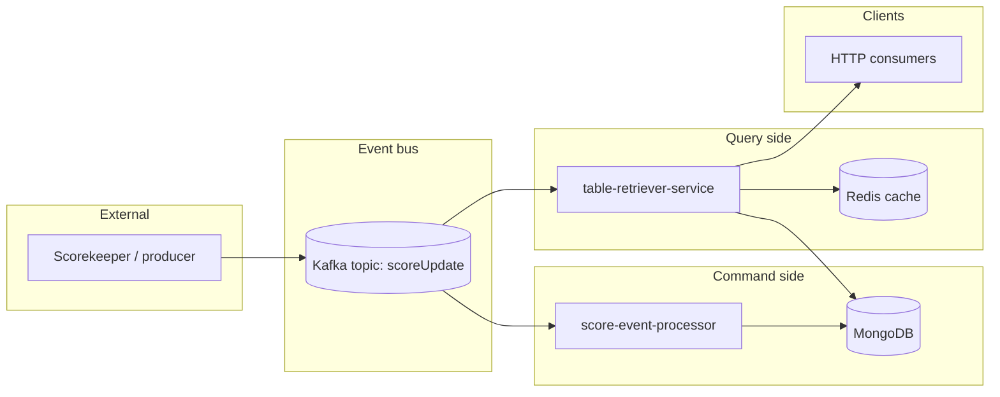

# League Table Management System

A **CQRS** reference implementation for football league tables: score updates flow in as immutable events, the **command** path materialises current standings into MongoDB, and the **query** path serves reads— including point-in-time and matchday snapshots—without overloading the write model.

This repository is designed to demonstrate **system design** (separation of concerns, event-driven boundaries, deployable modules) and **implementation craft** (domain rules, replay, caching, tests). Module-level READMEs cover internals; start here for the big picture.

---

## CQRS in this system

| Concern | Module | Responsibility |
|--------|--------|----------------|
| **Shared contract** | [`cqrs-events`](cqrs-events/) | `UpdatePointsEvent` / `Record` — the Kafka message shape both sides agree on |
| **Command (write)** | [`score-event-processor`](score-event-processor/) | Consume `scoreUpdate` → apply domain logic → persist **current** table to MongoDB |
| **Query (read)** | [`table-retriever-service`](table-retriever-service/) | HTTP API for latest table; **event replay** from Kafka for historical views; Redis for expensive replays |

Kafka is the **system of record** for match results. MongoDB holds a **materialised read/write projection** of “table as of now.” The query service can rebuild any past view by replaying events—an intentional CQRS pattern for temporal queries without polluting the command path.



**Typical flow:** a match finishes → producer publishes `UpdatePointsEvent` → command service updates MongoDB → query service (a) keeps its projection in sync via the same topic and (b) answers `GET /table/{id}` from MongoDB; for “table after matchday 5” it replays Kafka and caches the result.

---

## Modules

| Module | Docs | Port (local) |
|--------|------|--------------|
| Shared events | [cqrs-events/README.md](cqrs-events/README.md) | — (library) |
| Command service | [score-event-processor/README.md](score-event-processor/README.md) | 8080 |
| Query service | [table-retriever-service/README.md](table-retriever-service/README.md) | 8083 |

---

## Technology choices

- **Java 17**, **Spring Boot 3.4**, **Gradle** multi-project build
- **Apache Kafka** — durable event log (`scoreUpdate`)
- **MongoDB** — document store for `PointsTable` / `Standing`
- **Redis** — cache for replay-heavy query endpoints
- **Docker Compose** — Zookeeper, Kafka, MongoDB, Redis, both services with health checks

---

## Quick start

**Prerequisites:** JDK 17+, Docker with Compose v2.

```bash
make up
```

Brings up infrastructure and both services. Verify:

```bash
curl http://localhost:8080/actuator/health   # command
curl http://localhost:8083/ping              # query
```

**Build & test:**

```bash
./gradlew test
```

**Run on the host** (infra in Docker, apps via Gradle):

```bash
make infra
./gradlew :score-event-processor:bootRun
./gradlew :table-retriever-service:bootRun
```

**Stop:**

```bash
make down          # keep data volumes
make down-clean    # remove volumes
```

See module READMEs for API examples, package layout, and design notes.

---

## Design highlights

1. **Event-sourced reads, materialised writes** — The command side only needs “apply event → save snapshot.” Historical queries replay the log on the query side, keeping write paths simple and read models flexible.

2. **Shared domain kernel** — `ReconstructTableUtil` encodes ranking rules (points, goal difference, goals scored, goals conceded) in one place per service; `cqrs-events` keeps the wire contract stable.

3. **Independent deployables** — Each service is a bootable JAR and Docker image; `cqrs-events` is compiled in, not deployed alone.

4. **Operational ergonomics** — Makefile targets, Compose health checks, and Actuator/`/ping` endpoints support local demos and interviews.

---

## Repository layout

```
.
├── build.gradle / settings.gradle
├── docker-compose.yml
├── Makefile
├── cqrs-events/                 # shared event types
├── score-event-processor/       # command side
└── table-retriever-service/     # query side
```

---

## Context in a larger CQRS platform

In a full platform, a **scorekeeper** (or similar) service publishes to `scoreUpdate`; this repo owns **table materialisation and retrieval** only. That boundary keeps the league-table bounded context small, testable, and easy to reason about in isolation—while still showing how command/query split plays out in production-shaped code (Kafka, MongoDB, cache, containers).
