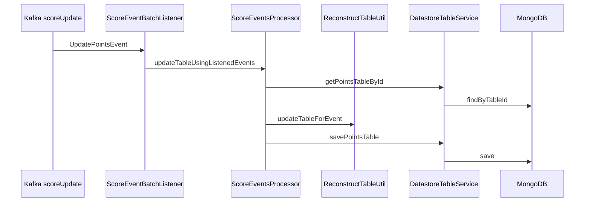

# Score Event Processor

**Command side** of the league-table CQRS split: subscribes to `scoreUpdate`, applies football table rules, and persists the **latest** `PointsTable` snapshot to MongoDB.

[← Root README](../README.md) · Shared contract: [`cqrs-events`](../cqrs-events/)

| | |
|--|--|
| **Port** | 8080 |
| **Health** | `GET /actuator/health` |
| **Stack** | Spring Boot, Spring Kafka, Spring Data MongoDB, Redis (configured; used for cache infrastructure) |

---

## Responsibility

This service owns the **write model path**:

1. Receive `UpdatePointsEvent` from Kafka.
2. Load existing `PointsTable` from MongoDB (or start empty).
3. Merge the fixture via `ReconstructTableUtil`.
4. Save the updated document.

It does **not** expose public table APIs—that is [`table-retriever-service`](../table-retriever-service/).

---

## Processing pipeline



### Entry point

`ScoreEventBatchListener` — `@KafkaListener(topics = "scoreUpdate", groupId = "scoreGroup")` delegates to `ScoreEventsProcessor`.

### Domain logic — `ReconstructTableUtil`

For each event:

- Upsert **home** and **away** `Standing` rows (points, W/D/L, goals, goal difference).
- **Sort** standings: points ↓, goal difference ↓, goals scored ↓, goals conceded ↑.
- Assign **rank** 1…n after sort.

`reconstructTableUsingEvents(List<UpdatePointsEvent>)` replays an ordered list—same rules used when rebuilding history on the query side.

### Persistence

| Type | Collection | Notes |
|------|------------|--------|
| `PointsTable` | `points_table` | `@Id` = `tableId` |
| `Standing` | embedded list | Team stats per row |

`DatastoreTableService` → `PointsTableRepository.findByTableId` / `save`.

---

## Configuration

| Property | Default (local) | Docker profile |
|----------|-----------------|----------------|
| `server.port` | 8080 | 8080 |
| `spring.kafka.bootstrap-servers` | `localhost:9092` | `kafka:29092` |
| `spring.data.mongodb.uri` | `mongodb://localhost:27017/points_table_database` | `mongodb://mongo:27017/...` |

Activate Docker settings: `SPRING_PROFILES_ACTIVE=docker`.

---

## Kafka consumer design

- **Listener:** `ScoreEventBatchListener` (active).
- **Container factory:** `kafkaListenerContainerFactory` in `KafkaConsumerConfig` (batch-capable; `JsonDeserializer` for `com.cqrs.events`).
- **Additional beans:** `kafkaConsumer` / `kafkaSnapshotConsumer` with custom `UpdatePointsEventDeserializer` for programmatic consumption patterns.

Legacy / experimental code (`KafkaMessageConsumer`, `KafkaConsumerScheduler`) is present but **not** registered as Spring beans— the `@KafkaListener` path is the supported integration.

---

## Package map

```
com.cqrs.scoreeventprocessor
├── listener/          ScoreEventBatchListener, Kafka helpers
├── processor/         ScoreEventsProcessor
├── util/              ReconstructTableUtil
├── service/           DatastoreTableService
├── model/             PointsTable, Standing
├── repository/        PointsTableRepository
└── config/
    ├── kafka/consumer/KafkaConsumerConfig
    ├── mongodb/       MongoConfig
    └── redis/         RedisCacheConfig
```

---

## Tests

```bash
./gradlew :score-event-processor:test
```

| Test class | Focus |
|------------|--------|
| `ReconstructTableUtilTest` | Ranking, draws, accumulation, tie-breakers |
| `ScoreEventsProcessorTest` | Create vs merge into existing table |
| `UpdatePointsEventSerializationTest` | Wire format |

These tests document expected domain behaviour—useful when extending rules (e.g. head-to-head).

---

## Run locally

```bash
# from repo root — Kafka + Mongo running
./gradlew :score-event-processor:bootRun
```

**Docker image** (monorepo context):

```bash
docker build -f score-event-processor/Dockerfile -t score-event-processor:local .
```

---

## Design notes

- **Idempotency:** Re-consuming the same event would double-count unless the producer guarantees at-most-once semantics or events carry idempotency keys—worth hardening in a production command handler.
- **Consumer group:** Uses `scoreGroup`; the query service also listens for projection updates—operational tuning may use separate groups per service in a larger deployment.
