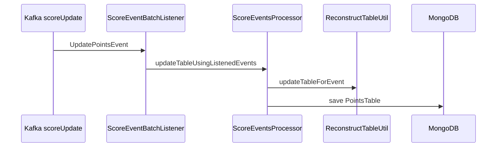

# Score Event Processor

**Kafka event processor** (write-side projector): consumes `UpdatePointsEvent` from `scoreUpdate`, applies football table rules, and persists the **latest** `PointsTable` snapshot to MongoDB.

This is **not** the CQRS command service—that role belongs to [`scorekeeper`](../scorekeeper/), which publishes events without blocking clients. This module **reacts** to the log.

[← Root README](../README.md) · Command: [`scorekeeper`](../scorekeeper/) · Contract: [`league-table-events`](../league-table-events/)

| | |
|--|--|
| **Port** | 8080 |
| **Health** | `GET /actuator/health` |
| **Stack** | Spring Boot, Spring Kafka, Spring Data MongoDB |

---

## Responsibility

1. Receive `UpdatePointsEvent` from Kafka (`ScoreEventBatchListener`).
2. Load existing `PointsTable` from MongoDB (or start empty).
3. Merge via shared [`LeagueTableReconstructor`](../league-table-domain/) (injected as `ReconstructTableUtil`).
4. Save the updated document.

It does **not** accept score commands or serve public table APIs—see [`scorekeeper`](../scorekeeper/) and [`table-retriever-service`](../table-retriever-service/).

---

## Processing pipeline



---

## Domain logic

Ranking and projection are implemented in [`league-table-domain`](../league-table-domain/) (`LeagueTableReconstructor`, `TableRanking`). This module injects them via `ReconstructTableUtil` (a thin `@Component` subclass).

---

## Configuration

| Property | Local | Docker profile |
|----------|-------|----------------|
| `server.port` | 8080 | 8080 |
| `spring.kafka.bootstrap-servers` | `localhost:9092` | `kafka:29092` |
| `spring.data.mongodb.uri` | `localhost:27017` | `mongo:27017` |

`SPRING_PROFILES_ACTIVE=docker` for Compose.

---

## Run locally

```bash
./gradlew :score-event-processor:bootRun
```

**Docker** (from repo root):

```bash
docker build -f score-event-processor/Dockerfile -t score-event-processor:local .
```

---

## Tests

```bash
./gradlew :score-event-processor:test
```

Covers ranking rules, processor merge paths, listener → persistence integration, and serialization.

---

## Design notes

- **Idempotency:** Duplicate delivery would double-count unless events are idempotent or deduplicated.
- **Consumer group:** Shares topic with query-side listener; use separate groups per service in production if needed.
