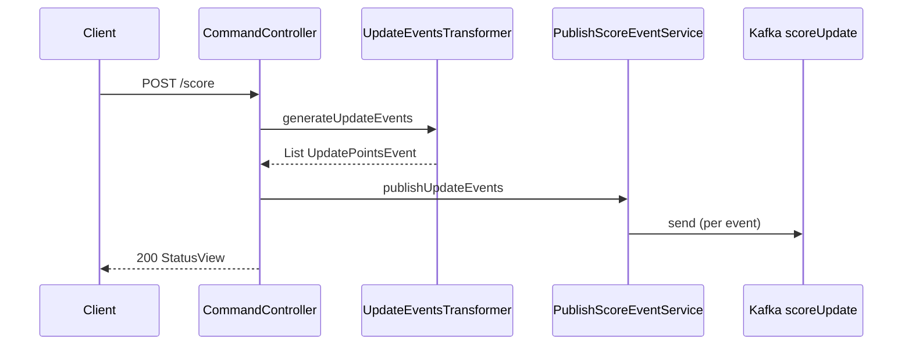

# Scorekeeper

**Command side** of the league-table CQRS system: accepts match results over HTTP, maps them to `UpdatePointsEvent`, and—in CQRS mode—**publishes to Kafka without blocking** the caller on downstream projection work.

[← Root README](../README.md) · Contract: [`league-table-events`](../league-table-events/) · Consumers: [`score-event-processor`](../score-event-processor/), [`table-retriever-service`](../table-retriever-service/)

| | |
|--|--|
| **Port** | 8081 |
| **Health** | `GET /ping` |
| **Stack** | Spring Web, Spring Kafka, Spring Data MongoDB |

---

## CQRS command behaviour

When `feature.cqrsmode=true` (default in this monorepo):

1. Client sends `POST /score` with one or more match results.
2. `UpdateEventsTransformer` builds `UpdatePointsEvent` list (3–1–0 points, goals, gameweek, timestamp).
3. `PublishScoreEventService` sends each event to topic `scoreUpdate` via `KafkaTemplate`—**async, fire-and-forget** from the HTTP thread’s perspective.
4. Response returns immediately with `200` (or `500` on failure).

Downstream [`score-event-processor`](../score-event-processor/) and [`table-retriever-service`](../table-retriever-service/) consume the same topic and update MongoDB independently. Clients never wait for those projections during command handling.

When `feature.cqrsmode=false`, scorekeeper applies events directly to MongoDB (local/dev shortcut without Kafka)—useful for isolated testing, not the primary architecture.

---

## Request flow



---

## API

| Method | Path | Description |
|--------|------|-------------|
| `POST` | `/score` | Record one or more match results |
| `GET` | `/ping` | Liveness |

### Example

```bash
curl -s -X POST http://localhost:8081/score \
  -H 'Content-Type: application/json' \
  -d '{
    "header": { "correlationId": "demo-001" },
    "body": {
      "scoreRecords": [{
        "tableId": "premier-2025",
        "homeTeam": "Arsenal",
        "awayTeam": "Chelsea",
        "homeTeamGoals": 2,
        "awayTeamGoals": 1,
        "homeTeamMatchNumber": 1,
        "awayTeamMatchNumber": 1,
        "gameweek": 4,
        "timeStamp": "2025-01-03T15:45:00+00:00"
      }]
    }
  }'
```

Fixture: [`src/test/resources/recordScoreRequestView.json`](src/test/resources/recordScoreRequestView.json).

---

## Configuration

| Property | Local | Docker (`application-docker.properties`) |
|----------|-------|------------------------------------------|
| `server.port` | 8081 | 8081 |
| `spring.kafka.bootstrap-servers` | `localhost:9092` | `kafka:29092` |
| `feature.cqrsmode` | `true` | `true` (set in Compose) |
| MongoDB | `localhost:27017` | `mongo:27017` (direct-write mode only) |

---

## Package layout

```
com.cqrs.scorekeeper/
├── controller/     CommandController
├── service/        PublishScoreEventService, ScoreEventsProcessor (direct mode)
├── util/           UpdateEventsTransformer; ReconstructTableUtil → league-table-domain
├── model/          API views, ScoreRecord; PointsTable/Standing from league-table-domain
├── producer/       Kafka producer wiring
└── config/         FeatureConfig
```

Event types `UpdatePointsEvent` / `Record` come from [`league-table-events`](../league-table-events/).

---

## Run locally

```bash
# from repo root, with Kafka up (make infra)
./gradlew :scorekeeper:bootRun
```

**Docker:**

```bash
docker build -f scorekeeper/Dockerfile -t scorekeeper:local .
```

---

## Tests

```bash
./gradlew :scorekeeper:test
```

`ScoreEventsProcessorTest` covers direct-write (`feature.cqrsmode=false`) persistence paths.

---

## Related modules

| Module | Relationship |
|--------|----------------|
| `league-table-events` | Shared event types published to Kafka |
| `score-event-processor` | Projects events to MongoDB |
| `table-retriever-service` | Serves queries and replay |
