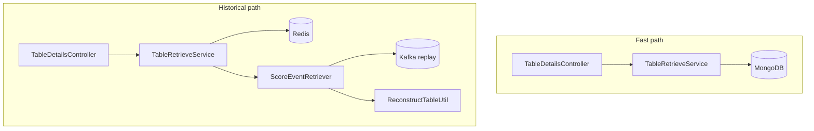

# Table Retriever Service

**Query side** of the league-table CQRS split: serves league tables over HTTP, maintains a MongoDB projection from Kafka, and answers **temporal** questions by **replaying** the `scoreUpdate` log (with Redis caching for hot paths).

[← Root README](../README.md) · Shared contract: [`cqrs-events`](../cqrs-events/)

| | |
|--|--|
| **Port** | 8083 |
| **Health** | `GET /ping` |
| **Stack** | Spring Web, Spring Kafka, Spring Data MongoDB, Spring Cache + Redis |

---

## Read paths

| Use case | Mechanism | Endpoint |
|----------|-----------|----------|
| **Latest table** | MongoDB snapshot (updated by listener + shared with command writes) | `GET /table/{tableId}` |
| **Table after matchday N** | Replay Kafka events where `gameweek ≤ N` | `GET /table/{tableId}/matchday/{matchday}` |
| **Table at instant** | Replay events with `timeStamp` before cutoff | `GET /table/{tableId}?instant={epochSeconds}` |



---

## HTTP API

### `GET /ping`

Liveness string for Compose health checks and quick smoke tests.

### `GET /table/{tableId}`

Returns `200` + `PointsTable` JSON if found; `204 No Content` if unknown.

```bash
curl -s http://localhost:8083/table/premier-league-2025 | jq
```

### `GET /table/{tableId}/matchday/{matchday}`

Rebuilds standings from all events for `tableId` with `gameweek ≤ matchday`, ordered by `timeStamp`.

```bash
curl -s http://localhost:8083/table/premier-league-2025/matchday/10 | jq
```

**Cache:** `@Cacheable` key `tableId + '-' + matchday` when `cache.enabled=true`.

### `GET /table/{tableId}?instant={epochSeconds}`

Rebuilds standings using events strictly before the given UTC instant.

```bash
curl -s "http://localhost:8083/table/premier-league-2025?instant=1715958000" | jq
```

---

## Kafka integration

### Live projection — `ScoreEventBatchListener`

Same topic and payload as the command service: each `UpdatePointsEvent` runs through `ScoreEventsProcessor` → MongoDB. Keeps the query service’s read store warm for `GET /table/{id}` without calling the command API.

### On-demand replay — `ScoreEventRetriever`

For historical endpoints, creates a **dedicated** consumer (`scoreOnDemandConsumerFactory`):

- `AUTO_OFFSET_RESET=earliest`
- Unique group id per request (`score-retriever-{uuid}`)
- `seekToBeginning`, poll until drained (with empty-poll guard for matchday; early exit when timestamp exceeded for instant queries)
- Filter by `tableId`, sort by `timeStamp`

Then `ReconstructTableUtil.reconstructTableUsingEvents` produces the `PointsTable`.

---

## Caching — `RedisCacheConfig`

| Setting | Default |
|---------|---------|
| `cache.enabled` | `true` |
| TTL | 10 minutes (`RedisCacheConfiguration`) |
| Property override | `spring.cache.redis.time-to-live` in `application.properties` |

`@Cacheable` methods in `TableRetrieveService` honour `condition = "@redisCacheConfig.isCacheEnabled()"`.

---

## Domain model

Mirrors the command service:

- `PointsTable` — MongoDB `@Document(collection = "points_table")`
- `Standing` — points, W/D/L, goals, goal difference, rank
- `ReconstructTableUtil` — identical ranking rules to command side

---

## Configuration

| Property | Local | Docker (`application-docker.properties`) |
|----------|-------|------------------------------------------|
| `server.port` | 8083 | 8083 |
| `spring.kafka.bootstrap-servers` | `localhost:9092` | `kafka:29092` |
| `spring.data.mongodb.uri` | via `MongoConfig` / properties | `mongodb://mongo:27017/points_table_database` |
| `spring.redis.host` | `localhost` | `redis` |
| `cache.enabled` | `true` | `true` |

---

## Package map

```
com.cqrs.tableretriever
├── controller/        TableDetailsController
├── service/           TableRetrieveService, DatastoreTableService
├── listener/          ScoreEventBatchListener, ScoreEventRetriever
├── processor/         ScoreEventsProcessor
├── util/              ReconstructTableUtil
├── model/             PointsTable, Standing
├── repository/        PointsTableRepository
└── config/
    ├── kafka/consumer/KafkaConsumerConfig
    ├── redis/         RedisCacheConfig
    └── mongodb/       MongoConfig
```

---

## Run locally

```bash
./gradlew :table-retriever-service:bootRun
```

Requires Kafka, MongoDB, and Redis (e.g. `make infra` from repo root).

**Docker:**

```bash
docker build -f table-retriever-service/Dockerfile -t table-retriever-service:local .
```

---

## CQRS trade-offs (query side)

| Choice | Benefit | Cost |
|--------|---------|------|
| MongoDB for latest | O(1) read by `tableId` | Must stay consistent with event stream |
| Kafka replay for history | Correct temporal views without event store DB | Latency + broker read load; mitigated by Redis |
| Duplicate listener + command | Decoupled deploy; query can catch up independently | Two consumers must be monitored; consider separate consumer groups at scale |

---

## Tests

```bash
./gradlew :table-retriever-service:test
```

Context-load test verifies Spring wiring; extend with WebMvcTest / integration tests against Testcontainers for interview-grade coverage.
